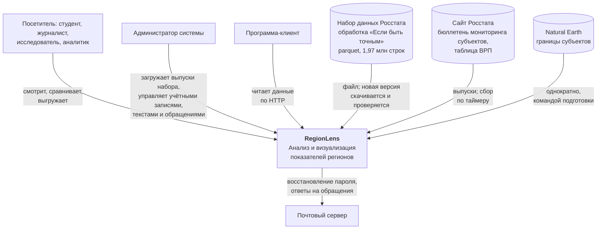
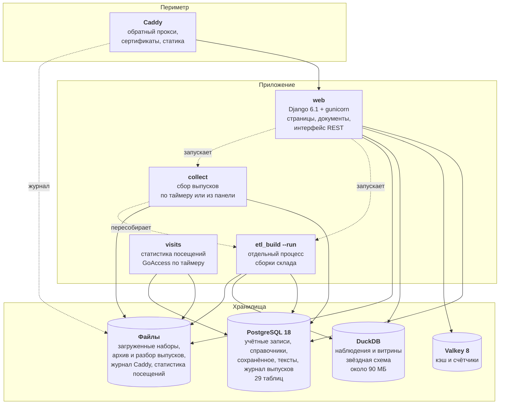
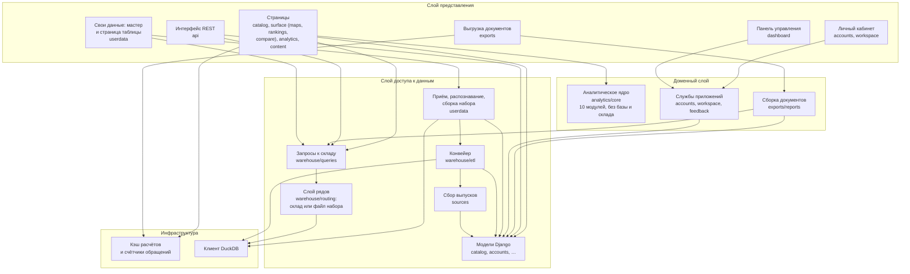
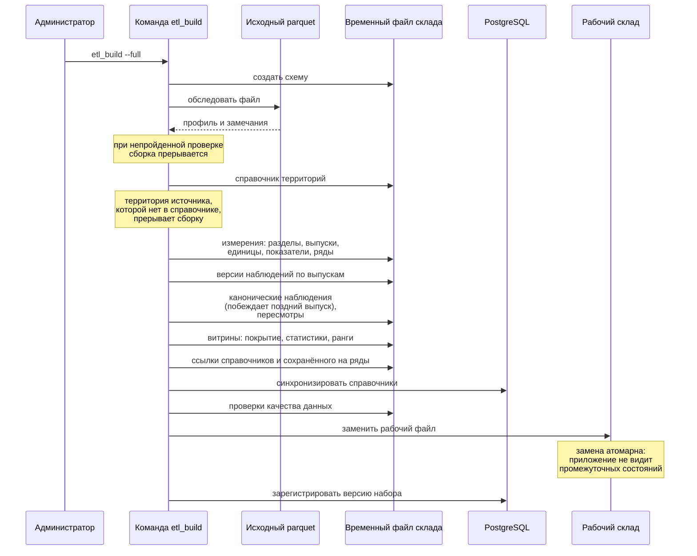
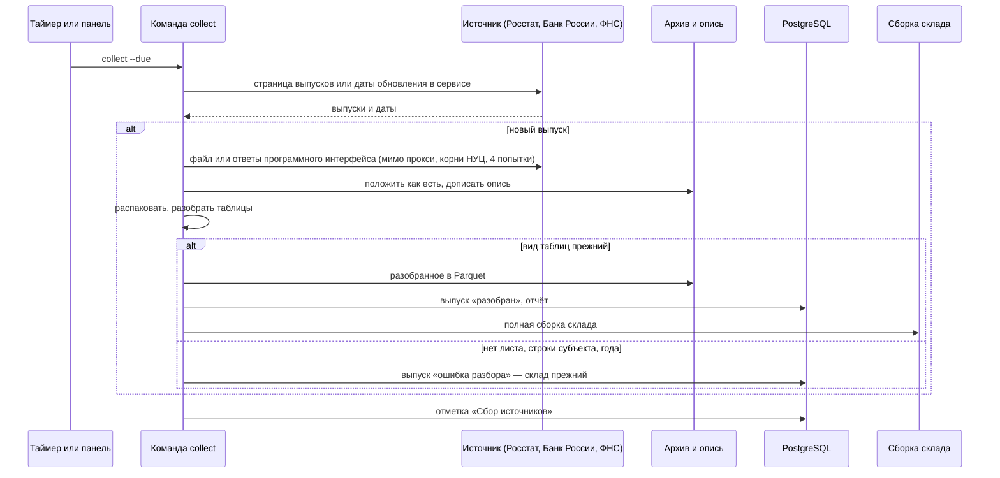
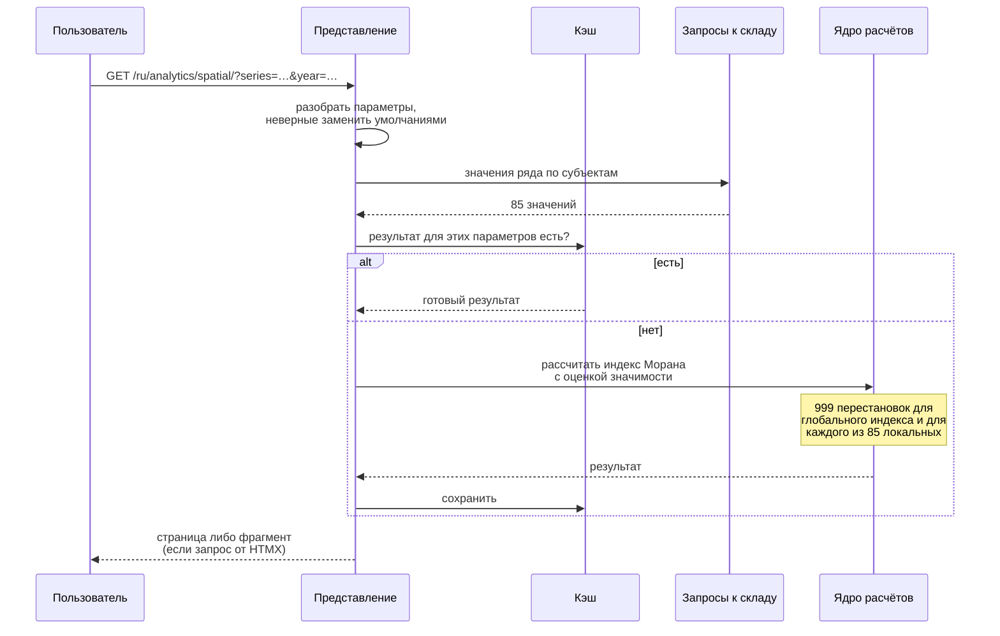
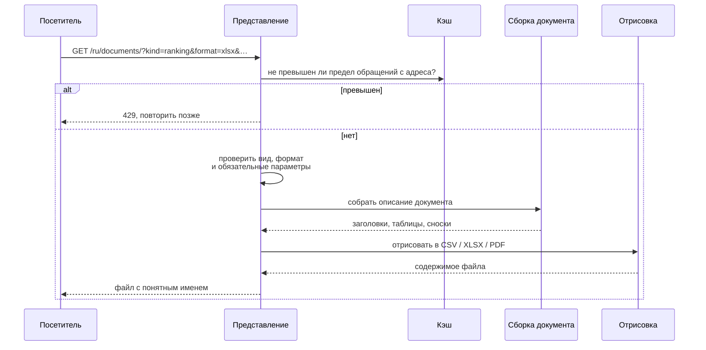
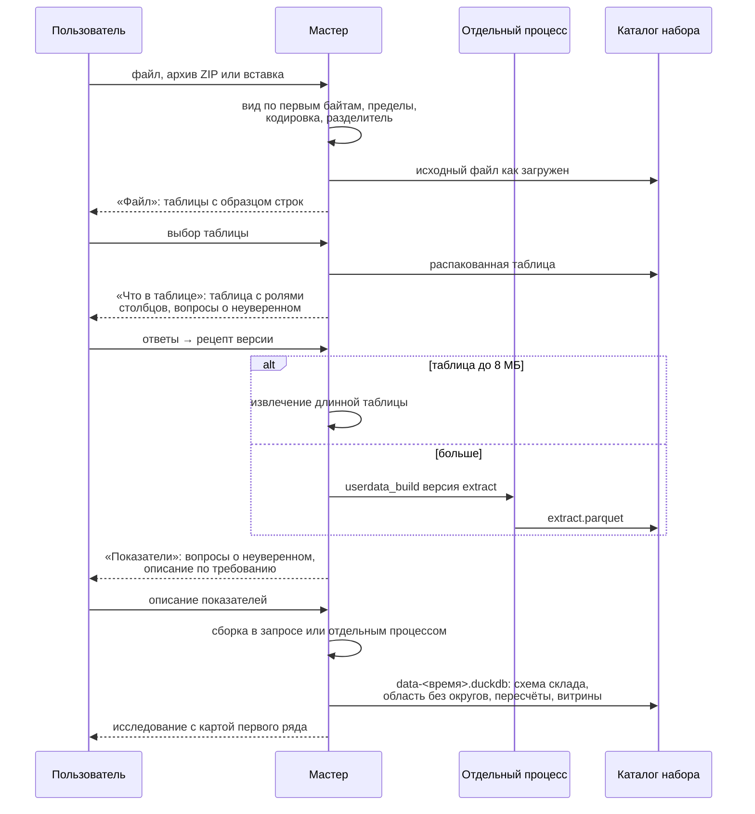

# Архитектура RegionLens

Устройство системы на четырёх уровнях детализации (по модели C4).

---

## 1. Контекст

Во время работы страниц система не обращается к внешним службам, кроме почтового узла.
Исходный набор — файл, границы субъектов готовятся однократно, клиентские библиотеки
и шрифты размещены на собственном домене. К сайту Росстата обращается только сборщик
выпусков (`collect`) — отдельным процессом по таймеру; без сети сайт работает
на последних собранных выпусках.

---

## 2. Контейнеры

Служб четыре: прокси, приложение, PostgreSQL и Valkey. Документ по запросу собирается
сразу — это доли секунды; письма тоже уходят сразу, с ограниченным ожиданием почтового
узла. Сборку склада из набора, загруженного в панели (до гигабайта памяти
и исключительный доступ к файлу), приложение запускает отдельным процессом команды
`etl_build --run` и не ждёт её; одновременно идёт одна сборка. Сбор выпусков
(`collect --due`, раз в день), статистику посещений (`visits`, раз в час) и удаление
персональных данных по сроку (`prune_personal_data`, раз в день) запускают таймеры хоста
в контейнере приложения.

Склад собирается в новый файл и подменяет рабочий. Веб-процессы узнают о подмене
по отпечатку файла (время изменения и размер): соединение с прежним файлом открывается
заново, а ключи кэша, зависящие от склада, несут отпечаток и после пересборки перестают
находиться — сбрасывать кэш не нужно. Тем же отпечатком помечены выборки склада,
кэшируемые до пересборки (`by_generation`), и адрес перечня рядов для списков выбора,
который браузер хранит год.

### Два хранилища

| Свойство | Оперативные данные (PostgreSQL) | Аналитические данные (DuckDB) |
|---|---|---|
| Объём | тысячи записей | 2 млн наблюдений |
| Обращения | точечные, по ключу | агрегирование по миллионам строк |
| Запись | постоянная, от пользователей | однократная, при сборке |
| Требования | целостность, транзакции, права | скорость агрегирования |

Склад — файл без отдельной службы; транзакции, миграции и права доступа — за PostgreSQL.

---

## 3. Компоненты

### Правила зависимостей

1. **Аналитическое ядро (`apps/analytics/core/`) не обращается ни к базе данных, ни
   к складу, ни к кэшу.** Из Django оно берёт только перевод подписей
   (`django.utils.translation`). Ядро принимает списки чисел и возвращает числа, поэтому
   формулы проверяются модульными испытаниями против эталонных значений из литературы,
   без запросов и подготовки данных, а обратиться к базе внутри цикла из ядра невозможно.
   Выборку данных и кэш расчётов берут на себя представления (`apps/analytics/views/`,
   `apps/analytics/selectors.py`).

2. **Представления не обращаются к складу напрямую.** Все обращения к DuckDB собраны
   в `apps/warehouse/queries/`, и изменение схемы склада имеет ограниченную область
   влияния.

3. **В склад пишет только конвейер.** Веб-процесс открывает склад только на чтение
   (`DUCKDB_READ_ONLY`, по умолчанию включено), что исключает повреждение файла
   при одновременном обращении. Запрос сверх `DUCKDB_MEMORY_LIMIT` DuckDB выгружает
   на диск — у каждого процесса свой каталог `regionlens.duckdb.tmp/<номер процесса>`:
   в общем каталоге файлы процессов совпадают по имени, и одновременная выгрузка
   роняет процессы.

4. **Расчёт живёт в ядре, а не в представлении.** Похожие регионы в паспорте
   субъекта — расстояние в стандартизованной матрице ключевых показателей
   (`apps/analytics/similar.py` поверх `apps/analytics/core/similarity.py`).

5. **Уровень ответа строится на основном наборе.** Паспорт региона, главная, каталог
   по темам и первая группа списка выбора читают один файл
   (`data/reference/featured_series.json`), а выводы словами — «лучше, чем
   в большинстве регионов», «на 15 % ниже, чем по России», «рост на 10 % за 5 лет» —
   собирает один модуль (`apps/catalog/passport.py`) для страницы и для документа.
   Выводы строятся на сервере по правилам из данных.

6. **Ряды своих данных идут через тот же слой запросов.** Ключ ряда таблицы
   пользователя — `u:<код набора>:<код ряда>`; декораторы маршрута
   (`apps/warehouse/routing.py`) направляют выборку с таким ключом в файл DuckDB набора,
   перечни ключей делят по источникам и сливают ответы. Источник выбирается переменной
   контекста, поэтому `fetch_dicts` и все выборки холста не меняются. Доступ проверяется
   до кэша: недоступный набор слой считает несуществующим и отправляет выборку в склад,
   где такого ряда нет, — даже если представление забыло проверку. Кто спрашивает,
   слою сообщает `UserDataScopeMiddleware`. Соединение с файлом набора — только чтение,
   без доступа к другим файлам и сети, с запертыми настройками, 128 МБ и один поток.

---

## 4. Ключевые процессы

### 4.1 Сборка аналитического склада

Сборка идёт минуты, и всё это время приложение отвечает на прежних данных: новый
склад собирается во временный файл и заменяет рабочий одной операцией. Неудачная
сборка не оставляет приложение с наполовину заполненным складом. После замены процесс
сборки прогревает кэш.

Новая версия набора сначала проходит проверку (`Pipeline.check_candidate`): те же этапы
до сверки ссылок включительно собирают склад во временный файл, затем он сравнивается
с рабочим (`apps/warehouse/etl/compare.py`) — ряды новые, исчезнувшие и переименованные,
изменённые значения, единицы, связи с выпусками источников, новые методические
примечания. Справочники PostgreSQL и рабочий склад не меняются, временный файл удаляется,
отчёт остаётся в журнале запуска. Рабочий склад собирается из этой версии обычной
сборкой, когда администратор её примет.

Ключи рядов, на которые ссылаются справочники проекта (основной набор, связи с выпусками
источников, статусы публикации, численность для рядов на жителя) и сохранённое
пользователями, сверяются с собранным складом (`apps/warehouse/etl/integrity.py`).
Пропавшие ряды сборку не прерывают: они записываются в журнал запуска, видны в его
карточке в панели, а о рядах из справочников проекта администратор получает письмо.

**Разметка разрывов** (`apps/warehouse/etl/classify.py`, при синхронизации справочников).
Примечание источника разбирается по частям: у каждой части — вид изменения (методика,
классификатор, состав территории, круг наблюдаемых объектов, база цен) и год, с которого
ряд несопоставим. «С 2017 года» даёт отметку на 2017 год; «до 2020 г. включительно»
и «с 2000 по 2020 г.» — на 2021-й; «за 2011–2021 гг. без учёта итогов переписи» —
на 2022-й. В перечне «2000–2018 гг. — …; 2019, 2020 гг. — …» отметка ставится на начало
каждого следующего периода, у диапазона по новому классификатору («за 2013–2018 гг.
в соответствии с ОКВЭД2») — на его начало. Пересчёт по итогам переписи и срок документа
(«госпрограмма на 2012–2020 годы») разрыва не ставят. Смена состава территорий
ставится только по части примечания, которая прямо говорит о территориях. Перемена
в составе одного субъекта — присоединение автономного округа к краю или области,
граница Москвы и Московской области, «до 2007 г. — включая данные по г. Санкт-Петербургу»
(`_SUBJECT_CHANGES`) — даёт отметку только ему (`SeriesBreak.territory`). Отметки рядов
ВРП ставятся по сноскам таблицы ВРП (`mart_source_note`); примечания сборника к прежним
значениям этих рядов отметок не дают.

### 4.2 Сбор выпусков внешних источников

Сборка склада заводит каждый выпуск изданием, переводит таблицы в годовые значения
рядов, сверяет их с набором за общие годы и продолжает ряды после последнего года
набора (правила — `docs/DATA_MODEL.md`, раздел 5). Выпуски Банка России и реестра МСП
ФНС дают ряды, которых в наборе нет: сборка заводит их измерения, строит значения
по месяцам (`fact_month`) и годовые значения из месяцев (раздел 5.1). Выпуск Банка
России — ответы программного интерфейса, собранные в ZIP; выпуск ФНС — сведения
реестра на одну дату, поэтому первый сбор берёт всю историю. Архив неизменяем,
разобранное и склад воспроизводятся из него (`collect --reparse`, `etl_build --full`).

### 4.3 Расчёт инструмента анализа

Ключ кэша строится по набору параметров, а не по адресу страницы: одни и те же
параметры в разном порядке дают один ключ. Ключ включает отметку сборки склада,
поэтому пересборка обесценивает сохранённые расчёты сама; срок хранения — час
(`ANALYTICS_CACHE_TTL`).

### 4.4 Выгрузка документа

Документ собирается в ответ на запрос и нигде не хранится: вход не нужен, ждать
нечего, и ссылку из меню «Скачать» можно передать другому человеку — по ней соберётся
тот же документ. Объём ограничен 5 000 строк, частота — 60 документами за десять минут
с одного адреса.

Описание документа отделено от отрисовки: три формата строятся из одного описания,
и новый формат не потребует переписывать сборку данных.

### 4.5 Приём своей таблицы

**Сопоставление территорий** (`userdata/matching.py`). Подпись сравнивается
со справочником после исправления латинских букв внутри русских слов, слипшихся слов
и сокращений («обл.», «респ.», «АО»); разговорные и английские формы и неоднозначные
написания — из `data/reference/territory_aliases.json`, узнаются коды ISO 3166-2
и ОКАТО. Нечёткое сравнение принимает написание при сходстве не ниже 0,9
(`FUZZY_ACCEPT`) и отрыве от второго кандидата не меньше 0,05 (`FUZZY_MARGIN`);
от 0,75 до 0,9 — кандидаты на выбор. Код ОКАТО или ОКТМО в строке решения не меняет:
в открытых наборах коды Архангельской и Тюменской областей противоречат друг другу,
решает название. «Архангельская область» и «Тюменская область» без уточнения — итог
вместе с автономными округами, как у Росстата; если та же область без округов в таблице
есть, итог узнаётся без вопроса, иначе сайт спрашивает. Для сумм область без округов
вычисляется вычитанием округов (пометка «расчёт RegionLens»), для долей и средних
остаётся пустой. Выбор вошедшего запоминается (`TerritoryLabel`).

Рецепт версии (выбранная таблица, роли, форма, год, отбор разрезов, ответы о территориях
и вложенных областях, описание показателей с пересчётами, свёртками и сменой методики,
формулы) хранится в PostgreSQL; по нему из исходного файла заново собирается тот же набор. Таблица до 8 МБ разбирается в запросе, большая —
отдельным процессом с опросом хода раз в секунду; одновременно — не больше двух разборов
(`USERDATA_PARALLEL_JOBS`), остальные ждут очереди; предел времени — 120 с. Сбой
разбора, не объяснённый правилами, приходит администратору письмом без содержимого файла.

---

## 5. Слой данных

### 5.1 Оперативное хранилище

36 собственных таблиц в PostgreSQL, включая таблицы связей «многие ко многим»:

| Группа | Таблицы | Назначение |
|---|---|---|
| Справочники | `catalog_territory`, `catalog_indicator`, `catalog_series`, `catalog_unit`, `catalog_section`, `catalog_publication`, `catalog_sourceedition`, `catalog_methodologynote`, `catalog_seriesbreak`, `catalog_territoryadjacency`, `catalog_datasetversion` и две таблицы связей | Навигация, поиск, переводы, отметки разрывов |
| Учётные записи | `accounts_user` и две таблицы связей; роли — `auth_group` с правами `accounts.PanelAccess` | Вход, роли, второй фактор |
| Рабочее пространство | `workspace_savedquery`, `workspace_favorite` | «Сохранённое»: виды экрана, регионы и показатели |
| Содержимое | `content_glossaryterm`, `content_methodologysection`, две таблицы переводов и таблица связей терминов | Тексты на двух языках |
| Обратная связь | `feedback_ticket` | Обращения |
| Служебные | `warehouse_etlrun`, `warehouse_dataqualitycheck`, `core_servicebeat` | Журналы сборки и проверок, отметки служб |
| Источники | `sources_source`, `sources_release` | Внешние источники и журнал их выпусков |
| Свои данные | `userdata_dataset`, `userdata_datasetversion`, `userdata_datasetseries`, `userdata_territorylabel`, `userdata_study`, `userdata_share` | Таблицы пользователей, их версии с рецептом, ряды, запомненные подписи территорий, исследования и закрытые ссылки |

### 5.2 Аналитическое хранилище

Звёздная схема: таблица фактов `fact_observation` и шесть измерений. Дополнительно —
таблица версий `fact_vintage`, помесячный слой `fact_month` и пять витрин: ранги,
статистики распределения
и покрытие рядов нужны почти каждой странице и рассчитываются один раз при сборке;
пересмотры и связи рядов с внешними источниками — разделам анализа и происхождению
значений.
Схема с описанием столбцов — в `docs/DATA_MODEL.md`.

### 5.3 Файлы своих данных

Каталог `USERDATA_DIR/<набор>/<версия>/` (том `userdata`): исходный файл как загружен,
распакованная таблица, `extract.parquet` — длинная таблица по рецепту, и `data-*.duckdb`
— файл набора со схемой склада. Файл набора неизменяем: новая сборка пишет новый файл,
прежний удаляется (занятый другим процессом — очисткой позже). Выборки холста
и витрины (`marts.build_*`) работают на нём без изменений; строки вне справочника —
в отдельной таблице `user_outside`.

Сборка одним проходом SQL кладёт в файл: ряды таблицы; свёртки (сумма по разрезу без
итоговых значений, месяцы в год); пересчёты каждого из них (на жителей и км², в ценах
последнего года по индексу цен региона из склада, Россия = 100, темп к прошлому году,
доля в сумме субъектов); показатели по формулам; ряды с периодами внутри года —
ещё и в помесячный слой `fact_month` под ключом группы показателя. Правила пересчётов:
в ценах последнего года T — только годовые значения в рублях, x(t) × I(t+1) × … × I(T) /
100^(T−t) по индексу потребительских цен региона из склада, при пропуске индекса за год
значения нет; «Россия = 100» делит на значение России из таблицы, у суммы без строки
России — на сумму субъектов за год, в котором есть все субъекты ряда; доля в сумме
субъектов — только у сумм; темп — к тому же периоду прошлого года, только у положительных
значений. Сумма по разрезу не включает итоговых значений («Всего», «Оба пола»); месяцы
сворачиваются в год суммой двенадцати (только у сумм), средним, значением декабря
или итогом «январь–декабрь», год без всех месяцев остаётся пустым. Коды производных рядов —
код исходного ряда с суффиксом, у формулы — постоянный код из рецепта, поэтому новая
сборка и новая версия файла дают те же ключи.

Формула (`userdata/formulas.py`) разбирается своим разборщиком в дерево; ссылки
на ряды — подписи этой таблицы, других таблиц того же владельца и рядов сайта —
заменяются ключами и в рецепте хранятся ключами. Дерево переводится в выражение DuckDB:
сдвиг по годам (`AGO`), место среди субъектов (`RANK`) и знаменатели деления — отдельными
столбцами промежуточных шагов, числа — параметрами, имена столбцов и функций — из перечня
модуля. Считается выражение в соединении в памяти без доступа к файлам и с запертыми
настройками по сетке «территория × год подряд». Таблица, на ряды которой ссылаются формулы
других таблиц, после своей сборки или удаления пересобирает их; круг таблиц при
сохранении формулы не допускается.

Значения рядов таблицы каждой версии лежат в файле набора выпусками — `fact_vintage`
и `dim_edition` с видом `version`, как сборники в складе: сборка новой версии переносит
выпуски прежних из файла версии, на которой она основана (при пересборке — из своего
прежнего файла), добавляет свой и строит витрину пересмотров `mart_revision` теми же
`facts.build_revisions`. Отчёт о различиях — пары «выпуск прежней версии — выпуск этой»
по ряду, субъекту и году; след значения и треугольник версий — те же выборки
`revision_trace` и `revision_triangle`, что у пересмотров склада (они ходят через слой
рядов). Файлы прежних версий читаются через соединения слоя рядов: открытый процессом
файл DuckDB второе соединение с другими настройками не открывает. На диске хранятся
последние `USERDATA_KEEP_VERSIONS` версий; значения удалённых остаются в выпусках новой.

Извлечение после чтения строк ищет коды-маски (`userdata/masks.py`): число из четырёх
и более одинаковых цифр, в десять и более раз больше 95-го процентиля остальных значений
своего показателя, становится пропуском; выбор человека хранится в рецепте. Одно название
у нескольких кодов показателя — разные показатели: код идёт в ключ ряда при чтении,
к названию он добавляется после.

---

## 6. Интерфейс

Страницы отрисовываются на сервере шаблонами Django. Клиентские сценарии:

* **HTMX** обновляет рабочую область при смене параметров, не перезагружая страницу
  целиком: инструменты пересчитываются часто, и полная перезагрузка сбрасывала бы
  положение прокрутки;
* **средства браузера** держат всплывающие панели: меню разделов шапки, меню учётной
  записи и панели действий («Сохранить», «Ссылка», «Скачать») — атрибут `popover`
  (верхний слой, нажатие мимо и Esc закрывают, открыта одна); командная палитра
  и выдвижное меню — модальное окно `<dialog>`. Собственный код только ставит панель
  под кнопкой и ведёт то, чего браузер не умеет: отборы, применяемые сразу
  (`data-autosubmit`), свёрнутое на телефоне (`data-fold-narrow`);
* **ES-модули и пользовательские элементы** без сборщика: входной модуль
  `static/js/app.js` собирает службы (`lib/`) и поведения на документе (`ui/`),
  а части разметки со своим состоянием — график `<rl-chart>`, выбор ряда
  `<rl-combobox>`, картограмма поверхности `<rl-choropleth>`, ползунок
  `<rl-time-slider>`, живая карта `<rl-live-map>` — пользовательские элементы.
  Модуль элемента загружается, когда элемент появился в документе, в том числе
  во фрагменте HTMX; элемент запускается сам и сам убирает за собой;
* **отрисовкой страниц клиентские сценарии не занимаются**: страницы и фрагменты
  приходят с сервера готовыми.

Диаграммы строит Apache ECharts. Картограмма рисуется на сервере разметкой SVG
(`apps/maps/cartogram.py`) и приходит браузеру готовой: своя проекция, врезки для
субъектов, неразличимых на общей карте, работа без сценариев.

### Главная

Уровень «ответа»: полоса «Мой регион» (если он выбран), живая карта одного из главных
показателей, вопросы с готовым ответом, главное о стране и три входа вглубь. Состав
собирается в `apps/core/showcase.py`, полоса региона — в `apps/catalog/brief.py`.

Живая карта — та же серверная картограмма, что и на рабочей поверхности, без подписей
значений. Поверх неё работает элемент `<rl-live-map>` (`static/js/elements/live-map.js`):
карточка под указателем, карточка региона по щелчку (`/regions/<slug>/card/`
во всплывающей панели), перебор годов, поиск своего региона, а на странице
показателя — перечни пяти наибольших и наименьших значений. Элемент ничего
не считает: классы шкалы, места, фразы паспорта и перечни крайних по каждому году
собирает сервер (`live_frames`). Кадр выбранного года встроен в разметку, остальные
приходят одним ответом `/showcase/frames/`, когда читатель тронет ползунок, — около
20 КБ в сжатом виде. Смена показателя заменяет блок карты через HTMX. Части разметки
(`core/partials/_live_*.html`) и стили (`static/css/live-map.css`) общие со страницей
показателя; раскладка у каждой страницы своя.

Без сценариев главная остаётся рабочей: регион ведёт в паспорт, показатель меняется
ссылкой, поиск региона отправляет в перечень регионов, перебор годов скрыт.

### Личный кабинет и доступ

Кабинет — четыре вкладки (`apps/accounts/cabinet.py`): обзор, «Сохранённое», обращения,
«Настройки». Настройки — одна страница с разделами «Профиль», «Вход и безопасность»
и «Персональные данные»; прежние адреса разделов ведут к ним, формы отправляются
на адреса своих действий и с ошибкой возвращают ту же страницу, редкие действия
(смена адреса, новые коды, выключение кода, удаление записи) раскрываются по нажатию.
Обзор — «мой стол»: «Мой регион» той же полосой, что на главной
(`catalog/partials/_region_band.html`: главное и четыре числа «Что сейчас»), «Продолжить» —
плитками последние виды, исследования и свои таблицы, и «Новое по сохранённому»
строкой на регион или показатель и источник (`apps/workspace/updates.py`): выпуски
источников из журнала `sources_release`, уже вошедшие в склад, сопоставляются
с отмеченными рядами и регионами по `fact_vintage` и `fact_month`; новая версия набора,
сменившая прежнюю, называет отмеченные ряды с последним годом набора. Новое — полученное
после прошлого визита; на время сеанса граница не сдвигается, писем об этом нет.

Плитка сохранённого (`apps/workspace/tiles.py`) — одна для вида экрана, региона,
показателя, исследования и своей таблицы: миниатюра, вид, название, показатель
и параметры словами. Миниатюра (`apps/workspace/thumbs.py`) — несколько путей SVG
без подписей: плиточная картограмма квинтилей у карты и показателя, столбики у рейтинга,
точки у распределения, линии у динамики, клетка региона у региона; у инструментов
анализа — значок. Значения берутся теми же выборками склада, что у страниц, из кэша
до пересборки. «Сохранённое» — плитки с отбором по виду; название и пометка правятся
на месте (`static/js/ui/inplace.js`, ответ — JSON), «Убрать» кладёт убранное в сеанс,
«Вернуть» восстанавливает его с прежним адресом и датами. Правки ограничены по частоте.

Меню «Сохранить» — одно на сайте (`apps/workspace/menu.py`, тег ``):
у вида экрана, в паспорте региона и на странице показателя. «В Сохранённое» — одним
нажатием: название вида даётся само (страница и параметры словами, занятое — с номером),
тот же вид второй раз не сохраняется; отметка региона или показателя снимается тем же
пунктом. «В исследование» кладёт вид карточкой, показатель — картой его ряда, регион —
к регионам исследования. С HTMX меню после действия приходит целиком. Версия набора в ссылках для цитирования,
документах и описании набора — текущая из журнала версий (`apps/catalog/versions.py`).

Вход — по почте и паролю под защитой django-axes; при включённом входе с кодом вторым
шагом спрашивается код из приложения (`apps/accounts/totp.py`, RFC 6238; QR-код ключа
рисует сервер кодировщиком reportlab). Неверный код django-axes учитывает как неудачный
вход. Страницы панели проверяют право своего раздела (`PanelPermissionMixin`) и то, что
сеанс прошёл код; меню панели строится по правам. Регистрация, восстановление пароля
и смена почты ограничены счётчиками в Valkey (`apps/core/throttle.py`) по адресу
посетителя и по почте или учётной записи; в регистрации и обращении — поле-ловушка.

«Мой регион» у гостя — cookie, у вошедшего — поле учётной записи. С него начинаются
главная и кабинет, в шапке — значок со ссылкой на паспорт, «Динамика» без выбора
территорий ставит его первым. Кнопка «Это мой регион» — в паспорте и карточке региона.

### Свои данные

Раздел `/ru/own-data/` — шестой пункт меню: что это, загрузка и пример, «Мои таблицы»,
какие таблицы подходят, кто их видит и сколько они хранятся. Мастер — три шага со своими
адресами: «Файл», «Что в таблице», «Показатели»; черновик хранится в базе, обновление
страницы ничего не теряет. После первой сборки открывается исследование с картой первого
ряда (у суммы — его пересчёта на 100 000 жителей): то, из панели которого начата загрузка,
иначе то, где ряды таблицы уже есть, иначе новое. Свои ряды живут в лаборатории: в перечнях
выбора холста и инструментов сайта их нет, кроме уже открытого (выбранного) ряда. Открытый
на холсте свой ряд подписан «Свои данные · <таблица>» и «видно только вам», ссылка
«О таблице» ведёт на страницу таблицы; запроса к интерфейсу у таких рядов нет.
Шаг «Что в таблице» — сама таблица: первые строки под шапкой, роль столбца — выбором над
ним; вопросы — только о неуверенном (подписи без территории, год, вложенные области, лишние
ряды), отбор разрезов и столбцы периодов широкой таблицы — по требованию. Шаг «Показатели»
спрашивает о том, что из таблицы не понять (вид величины без подсказки единицы и названия,
пустая единица, месяцы без годового ряда), остальное описание — в «Изменить»; новые пересчёты
добавляются в исследовании («Посчитать»), в мастере выбранные можно снять.

Страница таблицы — вкладки (вкладка и выбранный ряд — в адресе): «Данные» — показатели
списком и выбранный (ряды по разрезам и периодам, ряды без значений не выбираются, карта
выбранного ряда, «Открыть в исследовании», пять видов, «По месяцам», «С чем связан
показатель»), показатели по формулам; «Проверки» — пометки (абсолютные величины, мало
субъектов, неполный последний год, вложенные области, строки вне справочника), проверки
ведущих рядов, территории; владельцу — «Файл и версии» (файл, хранение, версии, удаление)
и «Доступ» (закрытые ссылки). Выгрузка очищенной длинной таблицы в CSV и XLSX и исходного
файла — меню «Скачать». Страницы таблиц и шагов — `noindex` и закрыты в `robots.txt`.

Показатель по формуле (`userdata/formula_views.py`) — шаблон «A на 1 000 B», «A − B»,
«A / B», «доля A в B» с рядами A и B или своя формула; показатели нажатием или
перетаскиванием встают в A, B или в формулу. Предпросмотр — расчёт по нынешним данным
с малой картой года, в котором больше всего субъектов, и «посчитано для N из 85»;
со сценарием обновляется сам, предпросмотры ограничены по частоте. Формула, открытая
из исследования, после сохранения встаёт в него картой.

Инструменты анализа принимают ряды своих таблиц (из исследования и по адресу):
направленность и вид величины — из описания показателя, смена методики, отмеченная
у показателя, — как разрывы рядов сайта. У таблицы меньше чем с двадцатью субъектами
неравенство, сближение и пространственный анализ не считаются; у суммы неравенство
предлагает ряд на жителя. Проверки ведущих рядов (`userdata/glance.py`) — правилами
по ведущему ряду каждого показателя: сверка суммы субъектов со значением России (вид
величины по данным: сумма совпадает со значением России с расхождением до 2 % или
составляет не меньше 85 % от него при значении России больше любого субъекта — величина
складывается; значение России между значениями субъектов — доля или среднее), смена
состава, пропуски последнего года; на странице таблицы — только
ряды с замечаниями; считаются при открытии страницы и хранятся в кэше расчётов до новой
сборки. «С чем связан показатель»
(`userdata/related.py`) — коэффициент Спирмена с рядами основного набора за последний
полный год с поправкой Бенджамини — Хохберга; облако точек пары — в «Корреляциях».

Таблица гостя привязана к случайному ключу в сеансе (в базе — его отпечаток), хранится
сутки и при входе переходит в учётную запись. Чужая таблица везде отвечает 404:
по адресу страницы, по ключу ряда на холсте, в документе и сохранённом виде.

**Новая версия таблицы** (`userdata/renew.py`) — черновик рядом с текущей: пока он не собран,
холст, ссылки и исследования работают на текущей. Рецепт прежней версии переносится: та же
таблица файла (по ключу, по имени без чисел или единственная), роли столбцов — по тексту
шапки, ответы о территориях и вложенных, отбор разрезов, выбор кодов-масок, описание
показателей и формулы. Спрашивается только новое — подписи, о которых раньше не спрашивали
(перечень `seen` в рецепте), новая вложенная область, год таблицы «показатели в столбцах»;
без вопросов версия собирается сама и открывает отчёт о различиях. Собранная новая версия
становится текущей; возврат к прежней — сменой текущей версии без пересборки.

**Закрытые ссылки** (`userdata/shares.py`) — на таблицу или исследование: токен из 24 знаков,
в базе — отпечаток SHA-256, срок, отзыв, разрешение скачивать. Адрес `/s/<токен>` без языка
запоминает ссылку в сеансе читателя и ведёт на страницу на его языке; неудачные попытки
с адреса ограничены. Читатель наборов `scope.Scope` знает ссылки сеанса: таблица ссылки
и таблицы владельца исследования, ряды которых в нём есть, читаются слоем рядов, а скачивание
(`routing.exportable`) — только с разрешения. Страницы чтения (таблица, «По месяцам», «С чем
связан», выгрузка) пускают читателя ссылки, шаги мастера, формулы, версии и удаление —
только владельца.

**Лаборатория: исследования** (`userdata/studies.py`, `study_views.py`, `study_cards.py`,
`lab.py`, `answers.py`) — рабочее поле: панель «Данные» (свои таблицы — показатели и ряды,
ряды сайта), общий год и регионы над полем, карточки и заметки. Карточка хранит, что
построить: вид холста (страница и параметры, как сохранённый вид) или ответ на вопрос
о ряде — лидеры и отстающие, мой регион (место среди регионов и в округе, соседи
по рейтингу), изменение за пять лет, кто вырос сильнее (одна мера изменения на всех:
пункты, проценты или разность), итоги по округам (значение округа из данных, иначе сумма
субъектов у сумм или медиана с размахом), тепловая таблица «регионы × годы» (общая шкала
квантилей), различие регионов (децильный коэффициент, Джини, вариация), сходство соседей
(глобальный индекс Морана), связи с основным набором; о двух рядах — связь (Спирмен
и облако точек) и сравнение (линии по годам для общего региона, моего или России — в своих
единицах при общей единице, иначе первый общий год = 100; связь по регионам и регионы,
места которых расходятся сильнее всего). Ответы — числами, без текста. «Что сделать»
у выбранного ряда — построить, посчитать, узнать, сравнить с рядом карточки поля или
с похожим официальным показателем (по названию — тем же разбором, что у поиска вопросом);
недоступное — серым с причиной. Ряд, брошенный на середину карточки, сравнивается с её
рядом; без мыши — «Сравнить с …» в «Что сделать» и «Сравнить с другим показателем»
в меню карточки. «Посчитать» отмечает пересчёт в описании показателя и пересобирает
таблицу; карточка нового ряда ждёт сборки и обновляется сама. Страница грузит карточки
фрагментами по одной, вид холста строится теми же сборщиками по копии запроса с параметрами
карточки и общим выбором, у карт — свои опознаватели контуров. Перетаскивание карточек
и рядов панели — SortableJS (`static/vendor/sortable.min.js`, только на этой странице),
то же без мыши — «Выше» и «Ниже» в меню карточки; название и заметки правятся на месте,
каждая правка сохраняется сразу, прежние блоки — для «Вернуть»; правки ограничены
по частоте. Мой регион отмечен во всех карточках, регион под указателем подсвечивается
во всех (`lib/highlight.js`). Исследование гостя, как таблица, привязано к ключу сеанса,
хранится сутки и при входе переходит в учётную запись. «В исследование» — в меню
«Сохранить» холста, инструментов, паспорта и страницы показателя. Печать — средствами
браузера по стилям печати.

**Картинки** (`static/js/lib/image-export.js`): у карты и графиков — PNG и SVG с заголовком,
годом, единицей и строкой источника (`data-image-*` у холста и карточек исследования); карта —
с легендой, график в SVG — отдельным экземпляром ECharts с векторной отрисовкой, без сервера.
Малые графики — карточка лаборатории (`userdata/answers.py`, `multiples`): регионы
по федеральным округам с полными названиями, шкала общая или своя у каждой клетки (выбор
хранится в карточке). В рейтинге — «было — стало» за год сравнения и год рейтинга; у облака
точек корреляций подписаны крайние субъекты, при перекосе предлагается логарифмическая шкала.

### Условия, политика и согласие

Три документа: «Условия использования» (`/terms/`), «Политика обработки персональных
данных» (`/privacy/`, ч. 2 ст. 18.1 152-ФЗ) и «Согласие на обработку персональных данных»
(`/consent/`, отдельно от условий по ч. 1 ст. 9). Даты редакций и сроки хранения —
в `apps/core/documents.py`; числа в текстах берутся оттуда и из настроек: условия
и издатели источников — из модулей сбора (`apps/sources/collect.SOURCES`), предел API —
из настроек DRF, срок сеанса и копий — из `SESSION_COOKIE_AGE` и `BACKUP_RETENTION_DAYS`,
срок журнала сервера проверка сверяет с `roll_keep_for` в `docker/Caddyfile`. Упоминание
Sentry появляется, только если он подключён; письма об ошибках идут без значений полей
форм (`FormFreeReporterFilter`).

Регистрация и форма обращения требуют отдельного флажка согласия (без отметки
по умолчанию, ссылка на текст — в новой вкладке); дата и редакция записываются
в `User.consent_at`, `consent_revision` и так же в обращении. У учётной записи, заведённой
без согласия или на прежнюю редакцию, «Мои данные» предлагают дать его заново. Сроки
из политики выполняет команда `prune_personal_data` (таймер хоста раз в сутки).

### Методика, глоссарий и термины

Раздел методики (`apps/content`): что показывает метод — одним предложением, формула,
пример на нынешних данных, два-три ограничения, свёрнутое изложение и литература.
Формула хранится записью MathML (строка — подпись и одна формула) и выводится
браузером без библиотек; разметка проходит белый список элементов и атрибутов
(`content/mathml.py`), потому что её правит и редактор в панели. Пример строится кодом
(`content/examples.py`) по рядам основного набора и региону читателя (без выбранного —
Татарстан): слова — из правил, числа — из склада, поэтому пример не расходится с сайтом
после новой сборки; результат хранится в кэше расчётов до новой сборки, без данных
раздел показывается без примера.

Тексты читателя подчиняются числовым правилам (`content/text_rules.py`): изложение
раздела — до 120 слов (раздел о своих данных — до 80), определение термина — до 40,
средняя длина предложения — до 15 слов, самое длинное — до 25, без «;» и без нескольких
тире в одном предложении. `seed_content` печатает нарушения предупреждениями, проверки
их не допускают. Как устроены действия лаборатории, сказано у самих действий («?»),
а не в методике.

Термин в интерфейсе — тег `` (`content/templatetags/glossary.py`):
подпись-кнопка, по нажатию — краткое определение из глоссария и ссылки в глоссарий
и раздел методики. Карточки терминов собираются один раз на отпечаток содержимого
и язык, отпечаток спрашивается один раз на запрос.

### Паспорт региона

Вводная — три строки с числами (`Passport.lead`): население с местом и изменением,
«в числе лучших» и «в числе худших» — до трёх показателей с местами; строка о полноте —
только когда сведений меньше, чем показателей в наборе. Те же строки — у полосы «Мой
регион», карточки живой карты, ответа поиска и документа паспорта. Доход и зарплата
в фиксированных наборах — у плиток этих рядов. Таблица «Все основные показатели»
приходит заголовками тем: строки темы догружаются при раскрытии (`?rows=theme-<тема>`,
«Развернуть все» — `?rows=all`, `static/js/ui/fold.js`), без сценариев — ссылкой
`?themes=all`. Перечень рядов у динамики догружается, когда поле подходит к окну.

### Страница показателя

Уровень «ответа» о величине (`/indicators/<slug>/?series=<ключ>`): главное словами
(крайние регионы и разница между ними, середина списка, годы и разрывы), плитка
«Россия», живая карта ряда с перечнями крайних, ход страны на фоне коридора квартилей
с отметками разрывов, сведения о ряде и переходы к рабочей поверхности и инструментам
анализа. Выводы собирает `apps/catalog/indicator.py`.

Живая карта открывает любой из 2 952 рядов. Ряд основного набора описан вручную
(короткое название, подпись единицы, направленность); остальные — по источнику
(`describe_series`): название показателя с разрезом, единица из склада, точность
по порядку величины, без оценки «лучше/хуже» — положение называется словами «выше»
и «ниже».

### Рабочая поверхность

Карта, динамика, рейтинг, распределение и таблица — пять представлений одного экрана
«показатель × территории × год». Показатель, территории и год живут отдельно от способа
их показа, и переход к другому представлению не требует набирать выбор заново.

Перечень представлений описан данными: `apps/surface/panels.py` содержит заголовки,
шаблоны, функции сборки и понимаемые параметры каждого представления. Общее состояние
разбирает `apps/surface/state.py`, каркас экрана — `apps/surface/views.py`. Сборка
представлений — в своих приложениях (`apps/maps/panel.py`, `apps/rankings/panel.py`,
`apps/compare/panel.py`); распределение и таблица собираются в
`apps/surface/builders.py`.

У каждого представления свой адрес: `/map/`, `/compare/`, `/rankings/`,
`/distribution/`, `/table/`. Вкладка — обычная ссылка, несущая текущий выбор, поэтому
любое состояние экрана адресуемо. Смена параметра обновляет холст
(`surface/partials/_main.html`), переключение представления заменяет рабочую область
вместе с рейлем, заголовком окна и «хлебными крошками» — у каждого представления свои
параметры построения. Какой из двух ответов собрать, видно по заголовку `HX-Target`.

Рейль — что смотрим: показатель, год, регионы (отмеченные — фишками, перечень —
по требованию, быстрые варианты «мой регион», «соседи», «похожие», «весь округ» —
`apps/surface/picks.py`: ссылка с `pick` дополняет выбор и переводит на обычный адрес). Как показать — в «Настроить вид» над графиком
(`surface/partials/_view.html`): шкала словами с образцом на значениях года, вид карты,
год сравнения, порядок. Форма охватывает рейль, а не всю рабочую область: на холсте стоит
собственная форма сохранения вида, а вложенную форму разбор разметки отбрасывает. Поля
«Настроить вид» приписаны к форме рейля атрибутом `form`, поэтому смена года уносит их
с собой, а смена в панели — весь выбор рейля (`hx-include`). Раскрытая панель остаётся
раскрытой после пересчёта (`data-keep-open`).

Под заголовком графика — строка вывода по правилам (`apps/surface/findings.py`): крайние
регионы и разница между ними, середина распределения, наибольший подъём и падение мест,
изменение линий, направление связи. Пояснения к полям и графикам — по нажатию «?»
(`partials/_hint.html`), постоянной надписью — только сообщение о том, что не так.

#### Связанность представлений

Наведение на строку таблицы отмечает тот же субъект на карте, в перечнях, в списке
выбора и линией на графике; наведение на линию отмечает строку. Связь держится на коде
территории: разметка сообщает о субъекте атрибутом `data-territory`, а линии графика
приносят соответствие «название — код» служебным разделом настроек `territories`,
который клиентский слой снимает до построения. Представления друг о друге не знают.

#### Ссылка, запрос и выгрузка

Экран описывается адресом целиком: число, названное в работе, должно открываться
по ссылке в том же виде, в каком его увидел автор. С любого представления доступны три
действия (`apps/surface/sharing.py`): полный адрес текущего вида, тот же выбор,
обращённый к точке данных программного интерфейса, и документ того вида, который
отвечает представлению (срез по субъектам за год или таблица «субъекты × годы»).

Вместе с адресом запроса показано, чем ответ интерфейса отличается от экрана:
интерфейс отдаёт наблюдения, а разбиение на классы, ранжирование и сводка считаются
над ними. Субъекты без наблюдений в ответе точки данных отсутствуют.

#### Узкий экран

Ниже 1023 пикселей панель выбора уходит под холст порядком в сетке; ниже 767 —
выезжает нижним листом по нажатию на закреплённую полосу вызова. Разметка одна и та же:
лист задан правилами оформления, а не вторым набором органов управления.

Лист включается признаком `data-rail` на корне документа, который ставит
`static/js/ui/sheet.js`, найдя на странице полосу вызова. Без сценариев признака нет,
и панель остаётся обычным блоком под холстом. Полоса вызова приходит вместе с холстом:
её сводка повторяет предмет экрана. Механизмом пользуются рабочая поверхность, каталог
показателей и инструменты анализа.

Ширина холста известна только браузеру, поэтому решения о раскладке принимаются
там: на холсте уже 520 пикселей подписи у концов линий уступают место легенде снизу
(поле под подписи — 186 пикселей, на телефоне это половина ширины), а точки полосы
распределения раскладываются без перекрытий по настоящей ширине холста — высота холста
следует за раскладкой (`lib/chart-options.js`, раздел `swarm`). Данные при этом
не пересчитываются.

#### Гарнитуры

Гарнитур три. Onest набирает интерфейс, связный текст и числа; Roboto Condensed —
плотные места: таблицы данных, подписи и легенду картограммы, подписи осей графиков;
JetBrains Mono — ключи рядов, коды территорий и версии набора, то есть значения,
которые читают по знакам. Узкое начертание нужно из-за длины русских названий
субъектов («Ханты-Мансийский автономный округ — Югра»): оно отделяет подпись,
помещающуюся в столбец, от обрезанной. Свойства начертаний, в том числе покрытие
русского алфавита, закреплены `tests/unit/test_typography.py`.

#### Загрузка

ECharts подключается сборкой из частей: используются несколько построений из сорока,
а географический слой — самая крупная часть полного файла — не нужен. Сборка
одноразовая, её результат лежит готовым файлом (`scripts/echarts/README.md`). График
строится, когда подходит к окну (`IntersectionObserver` с запасом в полэкрана), и
библиотека загружается с первым таким графиком: ради графиков ниже первого экрана её
не грузят; перед печатью строятся все.

Тяжёлые перечни догружаются по требованию. Выбор нескольких показателей — 575 строк
разметки, около четырёхсот килобайт — приходит свёрнутым до отмеченного
и разворачивается ссылкой: со сценариями она заменяет только этот блок, без них
открывает страницу с раскрытым перечнем. Список выбора одного ряда несёт в странице
только выбранный ряд, а полный перечень (121 КБ, сжатым 15 КБ) догружает отдельным
ответом, который браузер хранит год.

Смена страниц — короткое растворение (`@view-transition`).

Все библиотеки размещены на собственном домене (`static/vendor/`): это позволяет
объявить строгую политику содержимого (`SECURE_CSP`) и работать без выхода
в интернет. Встроенных сценариев нет.

---

## 7. Двуязычие

| Слой | Что переводится | Механизм |
|---|---|---|
| Интерфейс | Подписи, кнопки, сообщения | Каталог `locale/en`, функция `gettext`; русский — язык исходников |
| Содержимое | Глоссарий, методика | Переводимые поля моделей (django-parler) |
| Данные | Названия показателей, рядов, единиц и территорий | Столбцы `name_ru` и `name_en` |

Языковая версия различается адресом (`/ru/…`, `/en/…`), а не сеансом: ссылкой
на английскую страницу можно поделиться. Для поисковых систем объявлены связи
`hreflang` и раздельные карты сайта. Каталог перевода собирает
`scripts/i18n_tools.py` — без утилит GNU gettext.

---

## 8. Наблюдаемость

| Средство | Назначение |
|---|---|
| `/healthz` | Живость процесса; по ней контейнер перезапускает зависший экземпляр |
| `/readyz` | Готовность зависимостей: база, справочник территорий, склад |
| Структурированный журнал | На рабочем стенде — построчный JSON (`LOG_FORMAT`) |
| Журнал запусков конвейера | Длительность этапов, профиль источника, замечания качества |
| «Состояние служб» в панели | База, кэш, аналитический склад, последняя сборка, резервная копия, почта, адресаты писем об ошибках, сбор источников, статистика посещений, дисковое пространство — прямые проверки и отметки `ServiceBeat` |
| «Источники» в панели | Журнал выпусков, ошибки разбора, сверка рядов с набором, «Собрать сейчас» |
| Письмо об ошибке 500 | Адресатам из `DJANGO_ADMINS` с трассировкой (`apps.core.logging.ErrorMailHandler`): одна и та же ошибка — вид исключения и место в коде — не чаще раза в час; предел держит процесс, а между процессами — кэш. Отказ почты не обрывает ответ и отмечается в «Состоянии служб». Проверка стенда (`core.W001`) не пропускает запуск, если не заданы ни адресаты, ни Sentry |
| Письма о сборе и сборке | Адресатам из `DJANGO_ADMINS` (`apps.core.alerts`): выпуск не разобран, источник не ответил две проверки подряд, сборка не из панели не удалась. Одно и то же событие — не чаще раза в неделю, пока причина не устранена; не ушедшее письмо уйдёт при следующем таком событии |
| Sentry | Ошибки страниц, без персональных данных; включается `SENTRY_DSN`, по желанию |
| «Посещения» в панели | Статистика по журналу Caddy без счётчиков на страницах (`apps/core/visits.py`): раз в час команда `visits` дочитывает новые строки журнала (смещение хранится по номеру файла и отпечатку его первой строки и переживает деление журнала) и дописывает их в помесячную историю проекта без последней части адреса, строки запроса и служебных меток в адресах; статика и проверки состояния не берутся. GoAccess заново считает по истории отчёт JSON и своей базы не ведёт — его ключ `--anonymize-ip` усекает адреса только в отчёте, а база хранила бы полные. Панель показывает посетителей по дням и месяцам, страницы, переходы, 404, системы и браузеры; выгрузка по дням — CSV |
| Внешняя проверка | Служба наблюдения опрашивает `/healthz` и пишет владельцу, если стенд не отвечает |

---

## 9. Ограничения архитектуры

| Решение | Цена |
|---|---|
| Склад DuckDB в файле | Приложение и склад живут на одной машине; горизонтальное масштабирование веб-процессов потребует копии файла на каждом узле |
| Аналитика в веб-процессе | Расчёты инструментов идут в том же процессе, что и отдача страниц; защита — кэш результатов, предел объёма документа и частоты обращений. Отдельным процессом идёт только сборка склада |
| Отрисовка на сервере | Переключение вкладки требует обращения к серверу; смягчается обновлением через HTMX |
| Решение о новой версии набора | Новую версию набора сбор скачивает и проверяет сам, но рабочий склад заменяется только после решения администратора по отчёту о различиях |
| Разбор по виду таблиц | Смена вида таблицы у источника останавливает разбор выпуска до правки разбора; склад при этом остаётся прежним |
| Кэш в Valkey | Ещё одна служба и до 192 МБ памяти; её недоступность не роняет сайт, но замедляет его |
| Сборка в контейнере приложения | На время сборки приложению нужно до 2,5 ГБ из 4 ГБ сервера; перезапуск контейнера обрывает сборку (прежний склад остаётся в работе) |
| Письма без повторов | Отказ почтового узла виден в панели, письмо отправляется ещё раз нажатием |
| Свои данные в файлах на диске | Набор пользователя — файл DuckDB рядом с приложением; на несколько машин он не делится без общего хранилища. Разбор большой таблицы идёт в контейнере приложения и требует до 768 МБ памяти |
