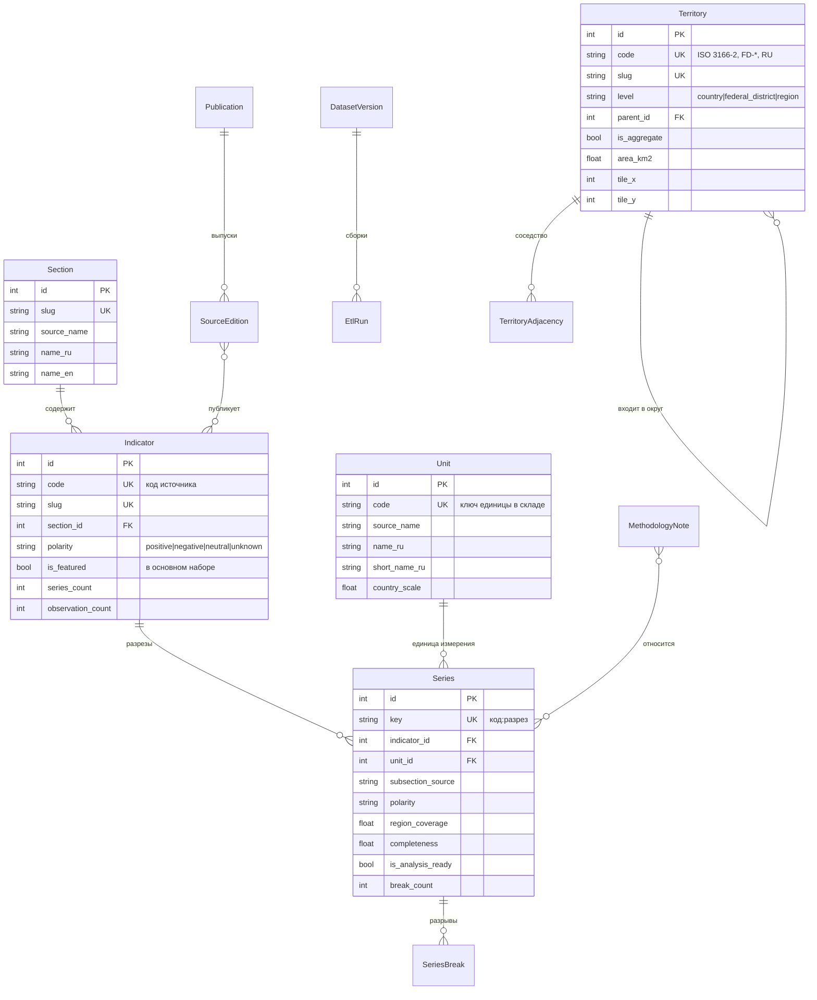
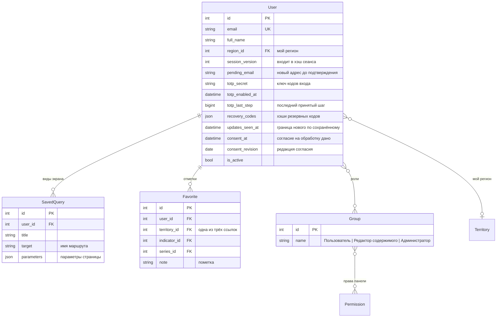

# Модель данных RegionLens

Два хранилища с разным назначением и разной моделью: оперативные данные лежат
в PostgreSQL в нормализованном виде, аналитические — в DuckDB в звёздной схеме.

---

## 1. Оперативное хранилище (PostgreSQL)

29 собственных таблиц, включая таблицы связей «многие ко многим». Схема задана
начальными миграциями приложений (`apps/*/migrations/0001_initial.py`).

### 1.1 Справочники

Особенности модели:

* **Единица анализа — `Series`, а не `Indicator`.** Показатель «Численность
  безработных» существует в разрезах «всего», «мужчины», «женщины»; сравнивать
  и ранжировать можно только конкретный разрез. Ключ ряда — код показателя и хэш
  названия разреза, из которого убраны переносы печатной вёрстки и опечатки
  (`data/reference/subsection_typography.json`): один разрез, напечатанный в разных
  выпусках с разными переносами, — один ряд. Ряд, которого после сборки нет в складе,
  удаляется из каталога.
* **`Territory` ссылается сама на себя** для связи «субъект — федеральный округ».
  Признак `is_aggregate` отделяет составные территории, которые нельзя включать
  в рейтинги: иначе данные учитываются дважды.
* **`Unit` ключуется кодом единицы склада, а не названием из источника:** у 43 единиц
  источник название не указал (`ND`), и по названию они слились бы в одну запись.
  `country_scale` — множитель, приводящий значение по стране к единице субъектов.
* **`is_analysis_ready`** рассчитывается при сборке склада и определяет, предлагается
  ли ряд в инструментах сравнительного анализа.
* **Направленность** (`polarity`) рядов основного набора берётся из
  `featured_series.json`, остальных — из разбора формулировки при сборке.
* **Поиск** идёт по названиям через функцию `rl_fold`, не зависящую от локали базы.

### 1.2 Учётные записи и рабочее пространство

Особенности:

* **`SavedQuery.parameters` хранит параметры, а не результат:** сохранённый вид
  открывается на текущих данных склада. Ряд вида, которого больше нет в складе, помечается
  в «Сохранённом» и называется при открытии.
* **Виды экрана и отметки показываются одной страницей «Сохранённое».** Отметка
  (`Favorite`) ставится на регион, показатель или отдельный ряд, к ней можно написать пометку.
* **Роли — группы Django с правами на разделы панели.** Права принадлежат служебной
  модели `accounts.PanelAccess` без таблицы: `manage_users` (пользователи и роли),
  `manage_data` (данные и источники), `manage_tickets` (обращения), `manage_content`
  (глоссарий и методика). Группы «Пользователь» (без прав панели), «Редактор содержимого»
  (содержимое и обращения) и «Администратор» (все права) заводит сигнал после миграций
  (`accounts.roles.ensure_roles`). Суперпользователь — администратор. Последний, у кого
  есть право `manage_users`, не может потерять роль, быть заблокирован или удалить себя.
* **Вход с одноразовым кодом (RFC 6238)** обязателен при любом праве панели и по желанию —
  остальным. Ключ хранится в `totp_secret`, `totp_last_step` не даёт принять код дважды,
  резервные коды — хэшами с ключом приложения.
* **`session_version` входит в хэш сеанса:** её увеличение завершает все сеансы, кроме
  пересчитанного текущего («Выйти на других устройствах», смена почты, включение
  и выключение входа с кодом). Смена пароля завершает сеансы и без неё.
* **Новый адрес почты** лежит в `pending_email`, пока не подтверждён ссылкой; ссылка
  подписана и привязана к прежнему и ожидающему адресу, поэтому одноразова.
* **Мой регион** — поле `region` у вошедшего и cookie `regionlens_region` у гостя; при входе
  регион гостя переходит в пустую учётную запись.
* **Удаление учётной записи** удаляет сохранённое; обращения остаются обезличенными
  (`author`, `contact_email`, `ip_address` и клиент стираются). Удаление — отзыв согласия.
* **Согласие на обработку** — `consent_at` и `consent_revision` у учётной записи
  и у обращения: оператор должен доказать его получение (ч. 3 ст. 9 152-ФЗ).
* **Ключей доступа, настроек интерфейса и журнала действий нет:** интерфейс REST открыт,
  язык и тема выбираются в шапке.
* **Журнала удачных входов нет** (`AXES_DISABLE_ACCESS_LOG`): последний вход хранит
  учётная запись (`last_login`). django-axes держит только неудачные попытки
  (`axes_accessattempt`: адрес, введённая почта, браузер) и удаляет их через час после
  последней. Что хранится о пользователе, зачем и сколько — в «Политике обработки
  персональных данных»; сроки выполняет команда `prune_personal_data`.
* **Документы в базе не хранятся.** Таблица значений, паспорт региона и рейтинг
  собираются в ответ на запрос из склада; адрес документа содержит все его параметры.

### 1.3 Содержимое, обратная связь, служебные таблицы

| Таблица | Назначение |
|---|---|
| `content_glossaryterm` и таблица переводов | Термины статистики; флажок «показывать на сайте» |
| `content_methodologysection` и таблица переводов | Разделы методики с формулами |
| `feedback_ticket` | Обращения; ответ один и хранится в самом обращении вместе с доставкой письма: `answer_delivery` (доставлено / не доставлено), `answer_sent_at`, `answer_attempts`, `answer_error`; согласие — `consent_at`, `consent_revision`; адрес IP и клиент стираются через 30 суток, имя и адрес обращения без учётной записи — через 365 суток после ответа или закрытия |
| `warehouse_etlrun` | Журнал запусков конвейера: режим (полная сборка, пересчёт витрин, синхронизация справочников, проверка новой версии набора), состояние (в очереди, выполняется, завершён успешно, завершён с ошибкой, прерван), кто запустил, файл набора, длительность этапов, профиль источника, ряды, на которые ссылаются справочники и сохранённое, но которых нет в складе; у проверки новой версии — отчёт о различиях с рабочим складом и решение администратора. Журнал пишется построчно, пока сборка идёт |
| `warehouse_dataqualitycheck` | Замечания к качеству данных; действующими считаются замечания последней сборки |
| `core_servicebeat` | Последняя отметка служб, которых веб-процесс не видит: резервная копия, почта (включая письма об ошибках 500), сбор источников и статистика посещений — время, исправность, подробности |
| `sources_source` | Внешний источник (бюллетень Росстата, таблица ВРП, сервис данных Банка России, реестр МСП ФНС): издатель, условия, страница, как часто проверять; время и исход последней проверки, идущий сбор |
| `sources_release` | Журнал выпусков: код («07-2026»), дата публикации и получения, адрес, путь в архиве, SHA-256 (уникален), размер; состояние разбора, версия разбора, отчёт по таблицам, изменения к прежнему выпуску, ошибка |

---

## 2. Аналитическое хранилище (DuckDB)

Звёздная схема. Определение — `apps/warehouse/sql/schema.sql`. Ключи (PK на схеме) —
логические: ограничения PRIMARY KEY не объявлены, единственность ключей проверяет сборка.

```mermaid
erDiagram
    dim_territory ||--o{ fact_observation : ""
    dim_series ||--o{ fact_observation : ""
    dim_indicator ||--o{ dim_series : ""
    dim_section ||--o{ dim_indicator : ""
    dim_unit ||--o{ dim_series : ""
    dim_edition ||--o{ fact_observation : ""
    dim_series ||--o{ fact_vintage : ""
    dim_series ||--o{ fact_month : ""
    dim_series ||--|| mart_series_coverage : ""
    dim_series ||--o{ mart_series_stats : ""
    dim_series ||--o{ mart_rank : ""
    dim_series ||--o{ mart_revision : ""
    dim_series ||--o| mart_source_link : ""
    dim_series ||--o{ mart_source_note : ""

    fact_observation {
        varchar series_key PK
        varchar territory_code PK
        smallint year PK
        double value "NULL при пропуске"
        tinyint quality "0..3"
        varchar edition_code
        tinyint revision_count
        tinyint flags "признаки значения"
    }
    fact_vintage {
        varchar series_key
        varchar territory_code
        smallint year
        varchar edition_code
        double value
        tinyint flags
    }
    fact_month {
        varchar series_key PK
        varchar territory_code PK
        smallint year PK
        tinyint month PK
        varchar kind PK "level | ytd | yoy"
        double value
        tinyint flags
        varchar edition_code
    }
    dim_edition {
        varchar edition_code PK
        varchar edition_label "2025 | 07-2026"
        date released_on
        varchar source_code "NULL — сборник набора"
        smallint edition_rank "порядок выхода"
    }
    mart_source_link {
        varchar series_key PK
        varchar source_code
        varchar method
        varchar link "full | conditional | revision"
        smallint junction_year
        double within_share
        integer revised_count
    }
    mart_source_note {
        varchar series_key PK
        smallint position PK
        varchar source_code
        varchar edition_code
        varchar note_text
    }
    mart_series_coverage {
        varchar series_key PK
        smallint region_count
        smallint year_count
        double region_coverage
        double completeness
        bool is_analysis_ready
    }
    mart_series_stats {
        varchar series_key PK
        smallint year PK
        double mean_value
        double median_value
        double coef_variation
        double decile_ratio
        double country_value
    }
    mart_rank {
        varchar series_key PK
        smallint year PK
        varchar territory_code PK
        smallint rank_desc
        double percentile
        double ratio_to_country
    }
    mart_revision {
        varchar series_key PK
        varchar territory_code PK
        smallint year PK
        tinyint edition_count
        double first_value
        double last_value
    }
```

### 2.1 Признак качества наблюдения

| Значение | Смысл | Источник |
|---|---|---|
| 0 | Наблюдение | Число в исходном наборе |
| 1 | Нет данных | Заглушка −99999999 |
| 2 | Значение скрыто источником | Заглушка −77777777 (прочерк, многоточие, крест в таблице) |
| 3 | Неприменимо | Строковая заглушка `CD` |

Пропуск и ноль — разные вещи. Заглушки, загруженные как числа, исказили бы любое
среднее; отброшенные без следа — лишили бы пользователя объяснения, почему на графике
разрыв. Значение пропуска — `NULL`, причина — в `quality`. Скрытое значение выпуска
источника («…», «-», «х» в таблице Росстата) получает тот же признак 2.

### Признаки значения

У значений из выпусков внешних источников `flags` — сумма битов (`apps.catalog.constants.ValueFlag`);
у значений набора — 0.

| Бит | Смысл |
|---|---|
| 1 | Предварительное: выпуск называет его предварительным или оценкой, либо это последний полный год выпуска |
| 2 | Рассчитано проектом: среднее месяцев или кварталов, реальная зарплата, значение на жителя |
| 4 | Знаменатель заморожен: на жителя по численности последнего известного года |

### Порядок выпусков

`dim_edition.edition_rank` — порядок выхода изданий: сборники набора — по году издания
(дата считается концом года; из сборников одного года первым идёт меньший код),
выпуски источников — по дате публикации. Из версий значения действует версия
с наибольшим номером среди непропущенных; пересмотры считаются в том же порядке.

### 2.2 Витрины

`mart_rank` содержит ранг каждого субъекта в каждом ряду за каждый год — около
1,5 млн строк. Ранги, статистики распределения и покрытие рассчитываются один раз
при сборке: они нужны почти каждой странице, а покрытие к тому же определяет
пригодность ряда одинаково для всех страниц.
`mart_revision` — наблюдения, значение которых различается между выпусками изданий.
`mart_source_link` — связь ряда с внешним источником: способ получения годового значения,
режим (`continue` — продолжение после последнего года набора, `supersede` — новая редакция
ряда), последний год набора и первый год источника, итог сверки (годы, пары «регион × год»,
доля в допуске, медиана и наибольшее расхождение, худший субъект) и число уточнённых
значений набора. Полная, условная или редакция — см. раздел 5.
`mart_source_note` — сноски последнего выпуска источника к показателю связи, в порядке
выпуска: по ним ставятся разрывы рядов, которые источник заменяет целиком.

---

## 3. Соответствие двух хранилищ

Измерения склада переносятся в справочники PostgreSQL при каждой сборке
(`apps/warehouse/etl/catalog_sync.py`). Переносятся только метаданные — около шести
с половиной тысяч записей; наблюдения остаются в складе.

| Что переносится | Зачем |
|---|---|
| Разделы, показатели, ряды, единицы, издания и выпуски | Навигация, поиск, переводы |
| Методические примечания и разрывы сопоставимости | Отметки на графиках |
| Условные связи с источниками (`mart_source_link`) | Разрыв «смена источника данных» на стыке |
| Сноски таблиц источников (`mart_source_note`) | Разрывы рядов, которые таблица заменяет целиком |
| Показатели покрытия рядов | Отбор рядов, пригодных к анализу |
| Основной набор (`featured_series.json`) | Направленность рядов набора, признак `is_featured` у показателей |

Синхронизация идемпотентна: записи обновляются по устойчивым ключам, поэтому ссылки
из сохранённого пользователями не разрушаются при пересборке. Единицы, на которые
не ссылается ни один ряд, удаляются.

---

## 4. Файлы базы данных в репозитории

| Файл | Содержание |
|---|---|
| `apps/warehouse/sql/schema.sql` | Схема аналитического склада |
| `apps/*/migrations/0001_initial.py` | Схема PostgreSQL — по одной начальной миграции на приложение |
| `data/reference/territories.json` | Справочник территорий |
| `data/reference/geography.json` | Координаты центров и площади |
| `data/reference/featured_series.json` | Основной набор: 69 рядов в 12 темах (см. ниже) |
| `data/reference/series_status.json` | Состояние публикации рядов у источника (см. ниже) |
| `data/raw/data_regions_collection_102_v20260313.parquet` | Исходный набор — вход конвейера |
| `data/reference/source_links.json` | Связи рядов с показателями внешних источников: способ и допуск сверки (раздел 5) |
| `data/reference/source_series.json` | Ряды проекта из Банка России и ФНС и помесячный слой рядов набора (раздел 5.1) |
| `data/reference/certs/russian_trusted_ca.crt` | Корневой и промежуточные сертификаты НУЦ Минцифры для сборщика |
| `data/reference/section_names.json`, `indicator_names.json`, `series_names.json`, `unit_names.json`, `publication_names.json` | Английские названия разделов, показателей, разрезов, единиц и изданий (см. «Переводы справочника») |
| `data/reference/note_texts_en.json` | Переводы показываемых примечаний Росстата |
| `data/reference/content_en.json` | Английские версии разделов методики и терминов глоссария |
| `data/reference/terms_en.json` | Словарь терминов для проверки переводов |
| `data/archive/<источник>/<дата>_<имя>`, `data/archive/MANIFEST.csv` | Неизменяемый архив полученных выпусков и опись |
| `data/sources/<источник>/<код>_<хэш>.parquet` | Разобранные выпуски — вход сборки склада, воспроизводимы из архива |
| `data/visits/history/ГГГГ-ММ.log`, `offsets.json`, `report.json` | История посещений в формате COMBINED (адрес без последней части, путь без строки запроса), докуда прочитан каждый файл журнала, отчёт GoAccess; журнал Caddy хранится 30 суток, история — за всё время и входит в резервную копию |

Собранный склад в репозитории не хранится: он воспроизводится командой
`python manage.py etl_build --full` и занимает около 90 МБ.

### Основной набор показателей

`featured_series.json` — вход для широкой публики. Полный перечень из 2 952 рядов
остаётся на уровне анализа; основной набор читают паспорт региона, главная, каталог
по темам, первая группа списка выбора ряда и документ «паспорт региона».

| Поле | Смысл |
|---|---|
| `themes[]` | Темы: `slug`, названия и пояснения на двух языках; порядок — порядок в каталоге |
| `key` | Ключ ряда в складе |
| `short_title_*`, `unit_label_*` | Короткое название и подпись единицы, заданные вручную: у части рядов источник подписывает единицу неверно («% к среднероссийской» у стоимости набора в рублях) или не подписывает вовсе |
| `polarity` | `positive`, `negative` или `neutral`; для рядов набора главнее разбора формулировки |
| `theme`, `order` | Тема и порядок; первые двенадцать по `order` задают наборы по умолчанию многомерных инструментов |
| `headline` | Плитка на главной и в паспорте (восемь рядов) |
| `absolute` | Величина не приведена к численности или площади: в оценку сильных и слабых сторон не входит, со страной не сравнивается |
| `question_*` | Вопрос-вход («Где самые высокие зарплаты?»), ведущий в рейтинг |
| `role` | `population` — вес мер неравенства, `default` — ряд первого экрана |
| `real` | Пересчёт денежного ряда в реальное выражение: `method` — `index` (индекс реальной величины к прошлому году, `index`), `volume` (индекс физического объёма итога `total`, для душевого ряда — с поправкой на численность) или `prices` (индекс потребительских цен); у неденежных рядов и стоимости набора поля нет |

Состав файла закреплён `tests/unit/test_featured_set.py`. Выводы паспорта словами
собирает `apps/catalog/passport.py` из выборки `territory_positions` (место, число
субъектов, значение страны, значения пятью годами раньше) и отметок разрывов:
методический разрыв внутри пяти лет отменяет вывод об изменении, смена состава
территорий — только сравнение с изменением по России. Изменение денежных рядов
пересчитывается в неизменные цены (`apps/catalog/real_terms.py`) по индексам из поля
`real`, и оценка «лучше или хуже страны» делается по реальному изменению.

### Состояние публикации рядов

`series_status.json` — что известно о продолжении рядов у источника: `continued`
(публикация продолжается, `source` — где: бюллетень мониторинга субъектов или таблица
ВРП) или `discontinued` (прекращена, `since` — год, `reason_*` — что известно). Ряда
нет в файле — сведений нет, и статус не показывается. Файл читает
`apps/catalog/status.py`; статус выводят страница показателя, паспорт региона
и документы. Если у продолжающегося ряда в складе есть связь с источником, статус —
«обновляется», а пояснение называет выпуск и итог сшивки.

### Переводы справочника

Английские тексты данных хранятся в `data/reference/` рядом с оригиналами и загружаются
командами: названия и единицы — `seed_catalog_names`, методика и глоссарий —
`seed_content_en`, территории — `seed_reference` (поля `*_en` в `territories.json`).
Ключ перевода связывает его с русским оригиналом, поэтому исправленный оригинал
остаётся без перевода, пока его не переведут заново:

| Файл | Ключ | Оригинал изменился |
|---|---|---|
| `*_names.json` | Русское название; у показателей — код | Нового названия нет в файле, оно показывается по-русски; у показателей правку названия перевод не замечает |
| `note_texts_en.json` | Отпечаток текста примечания (`make_checksum`) | Отпечаток не совпал, примечание показывается по-русски |
| `content_en.json` | Код раздела или адрес термина; поле `source` — отпечаток оригинала | `seed_content_en` называет версию устаревшей |

Перевод примечаний проставляет сборка склада (`MethodologyNote.text_en`); переводятся
только примечания, которые видит читатель. На английской странице у примечаний
и разрывов стоит пометка «перевод RegionLens» со ссылкой на русскую версию, а текст
без перевода помечен `lang="ru"`. `seed_catalog_names --check` перечисляет
непереведённое. `tests/unit/test_translations.py` проверяет каждый перевод
(`apps/core/translation_qa.py`): нет кириллицы, есть все числа оригинала, есть термины
словаря `terms_en.json`, отпечатки совпадают с нынешним оригиналом.

---

## 5. Выпуски внешних источников

После последнего года набора часть рядов продолжается по изданиям Росстата
(`apps/sources`); с новой версией набора граница продолжения сдвигается сама. Путь данных:

1. `collect` получает файл выпуска и кладёт его в архив как есть; опись `MANIFEST.csv`
   хранит SHA-256, размер, источник, исходное имя, адрес и время получения. Файл
   с тем же хэшем повторно не записывается.
2. Разбор (`rosstat_bulletin`, `rosstat_grp`) превращает таблицы в длинную таблицу
   Parquet со сведениями о выпуске в метаданных:

   | Столбец | Смысл |
   |---|---|
   | `measure` | показатель источника (`wage`, `cpi_december`, `grp`…) |
   | `territory_code` | код территории справочника |
   | `year`, `period_kind`, `period` | год и период: `month` 1–12, `quarter` 1–4, `ytd` (итог с января по месяц), `annual` |
   | `value`, `hidden` | число или скрытое значение |
   | `preliminary` | сноска выпуска отмечает год как предварительный |

   В таблице должна быть строка каждого из 85 субъектов (исключения заданы в описании
   таблицы); иначе выпуск не разбирается, и склад остаётся прежним.
3. Сборка склада (`apps/warehouse/etl/releases.py`) заводит выпуски изданиями,
   переводит показатели в годовые значения рядов по `source_links.json`, сверяет их
   с набором и добавляет версии значений.

`source_links.json`:

| Поле | Смысл |
|---|---|
| `series` | ключ ряда склада |
| `source`, `measure` | модуль источника и показатель разбора |
| `method` | `annual`, `year_total`, `december`, `quarter_end` — опубликованное годовое значение; `mean_months`, `mean_quarters` — среднее; `real_wage` — рост зарплаты к росту среднегодовых цен (`deflator` — показатель цен); `per_capita` — итог на жителя (`total_series` — итоговый ряд набора для численности) |
| `tolerance` | `relative` (доля) или `points` (пункты) — допуск сверки |

Сверка — по трём общим годам перед последним годом набора. Полная связь (в допуске
не меньше 90 % пар «регион × год») продолжает ряд после набора и уточняет последний год
набора, если источник разошёлся с ним больше допуска. Условная связь продолжает ряд,
но ставит на стыке разрыв «смена источника данных». Источник, который публикует новую
редакцию того же ряда (таблица ВРП), заменяет значения набора за все годы, где они
расходятся больше допуска. Разрывы такого ряда ставятся по сноскам таблицы
(`mart_source_note`: модуль разбора отдаёт сноски вместе с выпуском, они хранятся
в метаданных разобранного файла) теми же правилами, что примечания набора; примечания
набора, относящиеся к прежним значениям, у него разрывов не дают.

### 5.1 Ряды проекта и помесячный слой

Банк России и ФНС публикуют то, чего в наборе нет, поэтому их ряды заводит проект
(`data/reference/source_series.json`, читает `apps/sources/registry.py`):

- **Банк России** (`apps/sources/cbr.py`) — выпуск: ответы сервиса данных (`datasetsEx`
  и `dataEx` по публикациям), собранные в ZIP с постоянным временем записей; код —
  дата обновления показателей в сервисе. Показатели — по месяцам с 2019 года.
- **ФНС** (`apps/sources/fns_sme.py`) — выпуск: ответ статистики реестра МСП на одну дату
  (10-е число месяца); первый сбор берёт все даты страницы. Субъекты вне справочника
  хранятся в разобранном выпуске с приставкой `ext:` и в склад не идут.
- **Бюллетень Росстата** — лист «в среднем за период» таблицы 13-01 (`unemployment_3m`).

Сборка склада (`apps/warehouse/etl/monthly.py`) после упорядочения выпусков:

1. Заводит разделы, единицы, показатели и ряды проекта (`dim_series.source_code` —
   модуль источника; у рядов набора — `NULL`).
2. По каждому выпуску строит значения по месяцам: показатель выпуска (`measure`),
   отношение двух рядов или ряда к численности (`ratio`), у потоков — нарастающий итог.
   Численность — ВРП, делённый на ВРП на душу (среднегодовая, знаменатель Росстата);
   после последнего её года — замороженная. Значение по России у реестра МСП — сумма
   субъектов справочника.
3. Из месяцев того же выпуска строит годовые значения (`sum`, `december`, `january_next`,
   `weighted_mean`, `ratio`) и добавляет их версиями в `fact_vintage` — дальше они идут
   путём значений набора: `fact_observation`, пересмотры, витрины.
4. Записывает `fact_month`: из версий месяца побеждает поздний выпуск.

| Поле `fact_month` | Смысл |
|---|---|
| `series_key` | годовой ряд, к которому относится месячное значение (ряд проекта или ряд набора) |
| `year`, `month` | месяц, которым заканчивается период |
| `kind` | `level` — за месяц или на его конец (у безработицы — среднее трёх месяцев), `ytd` — с начала года (сумма или индекс к декабрю), `yoy` — к тому же периоду прошлого года, как публикует источник |
| `flags` | признаки значения, как у годовых |

Пригодность рядов проекта к сравнению — не меньше пяти лет (`SERIES_MIN_YEARS_SOURCE`)
при том же охвате субъектов. Помесячный слой читают `apps/catalog/monthly.py`
(«Что сейчас» в паспорте, помесячный блок страницы показателя, страница источников)
и API (`/api/v1/monthly/`).
